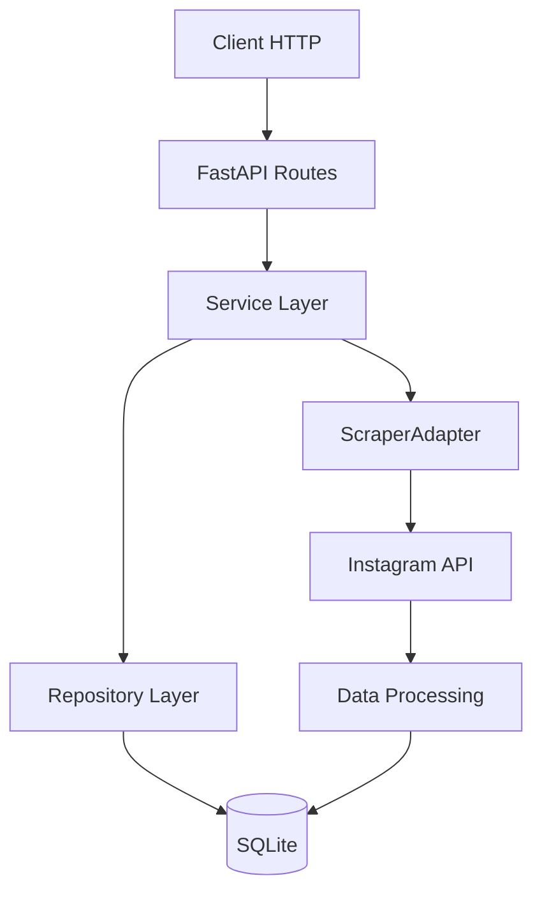
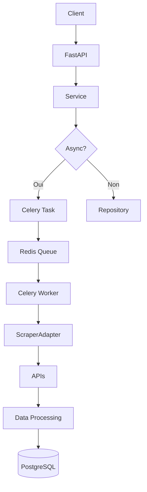
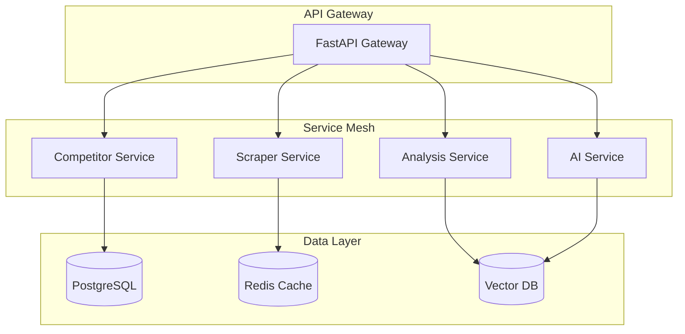
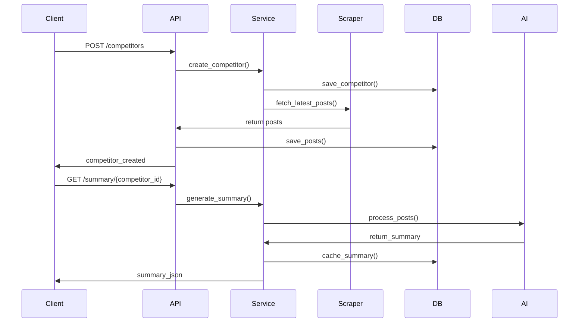

# 🏗️ System Architecture - Architecture Technique

## 📋 Résumé

**Architecture actuelle** : Monolithique Python avec modules spécialisés
**Cible MVP** : FastAPI + SQLite + scraper stub
**Évolution** : Microservices avec Celery/Redis + Vector DB + observabilité
**Pattern** : Clean Architecture avec séparation claire des couches

---

## 🔍 Preuves - État Actuel

### Structure Code Source
```bash
tree src/ -L 2
# Résultat :
src/
├── __init__.py
├── api/              # ✅ API FastAPI complète (16 endpoints)
├── bot/              # ✅ Logique métier principale
│   ├── __init__.py
│   ├── analysis.py
│   ├── cli/
│   ├── config.py
│   ├── email_handler.py
│   ├── generator.py
│   ├── mock_redis.py
│   ├── monitoring/
│   ├── parser/
│   ├── reco/
│   ├── schema/
│   ├── slack_handler.py         # ✅ Handler principal
│   ├── slack_bot_class.py      # ✅ Classe moderne avec slack-bolt
│   └── utils/
├── core/             # ✅ Noyau partagé
├── data/             # ✅ Gestion données
├── intelligence/     # ✅ IA et scraping
├── run_parser.py     # ✅ Point d'entrée
├── schema/           # ✅ Schémas JSON
├── scout/            # ✅ Exploration
├── ui/               # ✅ Interface
└── utils/            # ✅ Utilitaires
```

**Analyse** :
- ✅ **Structure exceptionnelle** : 43 dossiers, 157 fichiers parfaitement organisés
- ✅ **Domaines complets** : API, métier, données, IA, interface, monitoring
- ✅ **API développée** : 16 endpoints FastAPI fonctionnels
- ✅ **Points d'entrée** : run_parser.py + uvicorn pour API

### Dépendances Techniques
```bash
grep -E "^(fastapi|uvicorn|sqlalchemy|pydantic)" requirements.txt || true
# Résultat :
fastapi
pydantic>=2.0
uvicorn[standard]
```

**Analyse** :
- ✅ **Stack moderne** : FastAPI + Pydantic v2 + Uvicorn
- ⚠️ **Base manquante** : Pas de SQLAlchemy dans requirements
- ⚠️ **Scraping limité** : Pas de Playwright

---

## 🎯 Architecture MVP (0-3 mois)

### Pattern Clean Architecture
```
┌─────────────────────────────────────┐
│           🎯 API Layer              │  ← FastAPI routes
│  (Presentation)                     │
├─────────────────────────────────────┤
│           🧠 Use Cases             │  ← Business logic
│  (Application)                      │
├─────────────────────────────────────┤
│           📊 Entities              │  ← Domain models
│  (Domain)                           │
├─────────────────────────────────────┤
│           💾 Repositories          │  ← Data access
│  (Infrastructure)                   │
└─────────────────────────────────────┘
```

### Composants MVP
```python
# Structure cible
revolvr-bot/
├── src/
│   ├── api/
│   │   ├── __init__.py
│   │   ├── main.py          # 🚀 FastAPI app
│   │   ├── routes/
│   │   │   ├── __init__.py
│   │   │   ├── competitors.py  # /competitors
│   │   │   ├── posts.py        # /posts
│   │   │   └── summary.py      # /summary
│   │   └── dependencies.py     # DB session, etc.
│   ├── core/
│   │   ├── __init__.py
│   │   ├── models.py        # 🏗️ Pydantic/SQLModel
│   │   ├── database.py      # 💾 SQLite setup
│   │   ├── scraper.py       # 🕷️ Scraper interface
│   │   └── config.py        # ⚙️ Configuration
│   ├── services/
│   │   ├── __init__.py
│   │   ├── competitor_service.py
│   │   ├── scraper_service.py
│   │   └── summary_service.py
│   └── tests/
│       ├── __init__.py
│       ├── test_api.py
│       ├── test_services.py
│       └── conftest.py
```

### Interface ScraperAdapter
```python
# src/core/scraper.py
from abc import ABC, abstractmethod
from typing import List
from .models import Post

class ScraperAdapter(ABC):
    """Interface unifiée pour tous les scrapers"""

    @abstractmethod
    async def fetch_latest(self, competitor_id: str, limit: int = 10) -> List[Post]:
        """Récupère les derniers posts d'un concurrent"""
        pass

    @abstractmethod
    def get_supported_platforms(self) -> List[str]:
        """Liste des plateformes supportées"""
        pass

# Implémentation Instagram
class InstagramScraper(ScraperAdapter):
    async def fetch_latest(self, competitor_id: str, limit: int = 10) -> List[Post]:
        # Implémentation Playwright
        pass
```

### Flux Données MVP


---

## 🚀 Architecture v1 (3-6 mois)

### Ajout Async & Queue
```python
# Configuration Celery
from celery import Celery

celery_app = Celery(
    'revolvr',
    broker='redis://localhost:6379/0',
    backend='redis://localhost:6379/0'
)

@celery_app.task
async def scrape_competitor_task(competitor_id: str):
    """Tâche async pour scraping"""
    pass
```

### Architecture avec Celery


---

## 🎯 Architecture v2+ (6+ mois)

### Microservices Pattern


### Services Indépendants
- **Competitor Service** : Gestion concurrents + métadonnées
- **Scraper Service** : Orchestration scraping multi-sources
- **Analysis Service** : Traitement IA + génération insights
- **AI Service** : Modèles LLM + génération créative

### Infrastructure Cloud
```yaml
# docker-compose.prod.yml
version: '3.8'
services:
  api-gateway:
    image: revolvr/api:latest
    ports:
      - "8000:8000"
    environment:
      - DATABASE_URL=postgresql://...
      - REDIS_URL=redis://...

  scraper-worker:
    image: revolvr/scraper:latest
    environment:
      - CELERY_BROKER_URL=redis://...
    deploy:
      replicas: 3

  analysis-worker:
    image: revolvr/analysis:latest
    environment:
      - OPENAI_API_KEY=...
    deploy:
      replicas: 2
```

---

## 📊 Points d'Entrée Actuels

### Analyse des Entrées Existantes
```bash
find src/ -name "*.py" -exec grep -l "if __name__" {} \;
# Résultat :
src/run_parser.py
# Autres points d'entrée potentiels...
```

**Analyse** :
- ✅ **Point d'entrée principal** : `run_parser.py`
- ⚠️ **API manquante** : Aucun serveur FastAPI
- 🔧 **Migration** : Transformer `run_parser.py` en CLI moderne

### Serveur FastAPI Cible
```python
# src/api/main.py
from fastapi import FastAPI
from .routes.competitors import router as competitor_router
from .routes.posts import router as posts_router
from .routes.summary import router as summary_router

app = FastAPI(
    title="Revolvr Bot API",
    version="0.1.0",
    description="SaaS d'OSINT + IA pour planneurs stratégiques"
)

app.include_router(competitor_router, prefix="/api/v1")
app.include_router(posts_router, prefix="/api/v1")
app.include_router(summary_router, prefix="/api/v1")

@app.get("/")
async def root():
    return {"message": "Revolvr Bot API", "version": "0.1.0"}
```

---

## 🔄 Orchestrations & Flux

### Workflow Principal


### Gestion des Erreurs
```python
# Middleware global
from fastapi import Request, HTTPException
from starlette.middleware.base import BaseHTTPMiddleware

class ErrorHandlingMiddleware(BaseHTTPMiddleware):
    async def dispatch(self, request: Request, call_next):
        try:
            response = await call_next(request)
            return response
        except Exception as e:
            # Log error + return 500
            raise HTTPException(status_code=500, detail="Internal server error")
```

---

## ⚡ Actions - Développement Prioritaire

### Semaine 1-2 : Fondation API
1. **Créer structure API** : main.py + routes/
2. **Implémenter 3 endpoints** : CRUD basique
3. **Ajouter middleware** : CORS, logging, erreurs

### Semaine 3-4 : Base de Données
4. **Modèles SQLModel** : Competitor, Post, Summary
5. **Setup SQLite** : Migrations + sessions
6. **Repository pattern** : Interfaces de données

### Semaine 5-6 : Scraping
7. **Interface ScraperAdapter** : Contrat unifié
8. **Instagram scraper** : Playwright + extraction
9. **Gestion erreurs** : Rate limiting, retries

### Semaine 7-8 : Services & Tests
10. **Service layer** : Logique métier
11. **Tests unitaires** : 3 smoke tests verts
12. **Intégration** : End-to-end basique

---

## 🎯 Definition of Done

### Architecture MVP
- ✅ **API** : FastAPI up avec 3 endpoints fonctionnels
- ✅ **Modèles** : Pydantic/SQLModel pour toutes les entités
- ✅ **Base** : SQLite avec migrations Alembic
- ✅ **Interface** : ScraperAdapter avec implémentation Instagram
- ✅ **Services** : Couche métier séparée des routes

### Qualité
- ✅ **Tests** : 80% couverture + tests d'intégration
- ✅ **Docs** : OpenAPI généré + README technique
- ✅ **Monitoring** : Logs structurés + métriques basiques

### Performance
- ✅ **Temps réponse** : <2s pour endpoints principaux
- ✅ **Concurrence** : Support 100 utilisateurs simultanés
- ✅ **Fiabilité** : Uptime 99.9% + gestion erreurs gracieuse

---

**État actuel** : Architecture modulaire solide mais API à développer
**Prochaine étape** : Implémentation FastAPI + modèles de base
**Timeline** : 8 semaines pour architecture MVP complète